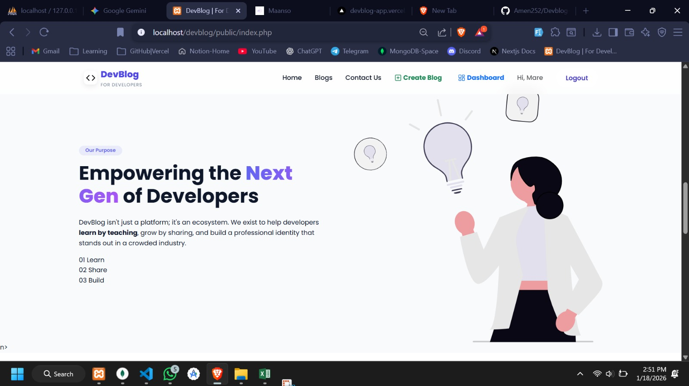
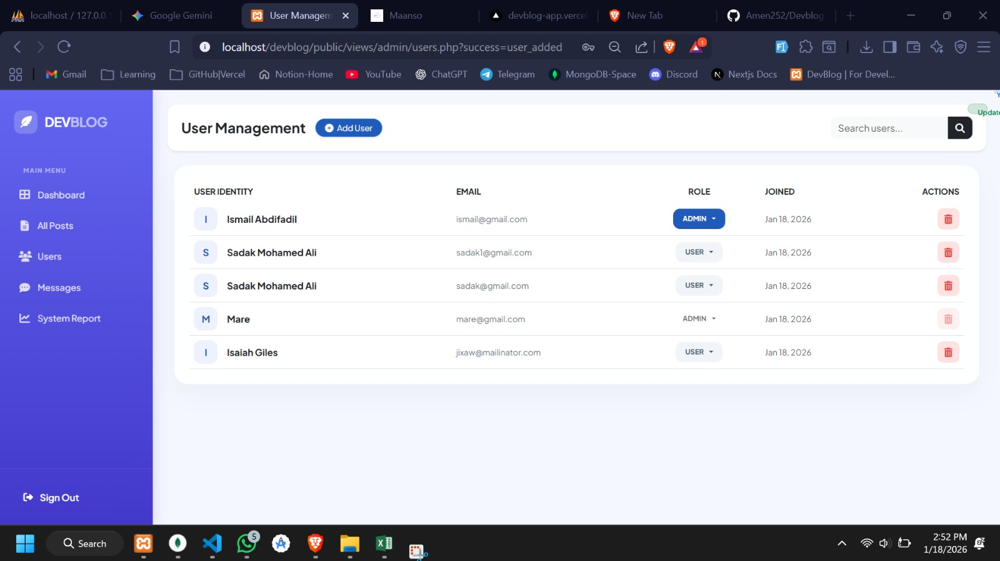
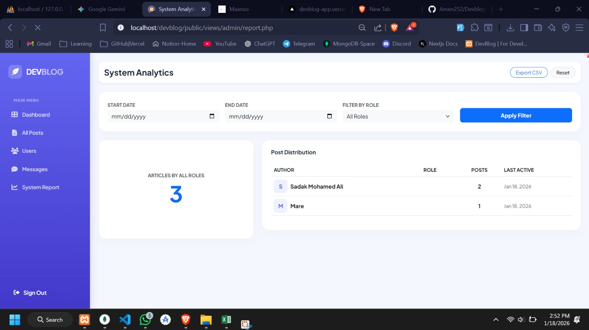

# 🚀 DEVBLOG - Modern Blog Management System

A sleek, responsive, and secure PHP-based blogging platform featuring a premium glass-morphism admin dashboard, advanced analytics, and role-based access control.

---

## 📸 Screenshots

### 🏠 Home Page
The public landing page showcasing the latest featured articles and categories.


### ⚡ Hero Section
A bold, high-impact hero area designed to grab user attention immediately.


### 👥 User Management
An administrative interface for managing users, roles (Admin/User), and account statuses.


### 📊 System Reports & Analytics
Advanced reporting tool with date filtering, author activity tracking, and CSV export functionality.


---

## ✨ Features

- **Admin Dashboard:** Centralized control over all system content and users.
- **Role-Based Access Control (RBAC):** Secured environment with distinct permissions for Admins and Users.
- **Advanced Analytics:** Real-time tracking of total articles and individual author activity.
- **System Filtering:** Dynamic reports filtered by "From" and "To" date ranges.
- **Data Export:** Generate and download professional CSV reports with a single click.
- **Glass-morphism UI:** Modern, clean interface built with Bootstrap 5 and Plus Jakarta Sans typography.

## 🛠️ Tech Stack

- **Backend:** PHP 8.x
- **Database:** MySQL
- **Frontend:** HTML5, CSS3 (Custom Glass-morphism), Bootstrap 5
- **Icons:** Font Awesome 6.4

---

## 📂 Project Structure

As seen in the development environment:

```text
DEVBLOG/
└── public/
    ├── admin/          # Admin-side logic and processing
    ├── app/            # Core configuration and database connection
    ├── assets/         # Global CSS, JS, and UI images
    ├── screenshots/    # Project preview images (.jpeg)
    ├── views/          # Frontend and Admin page templates
    └── index.php       # Application entry point
